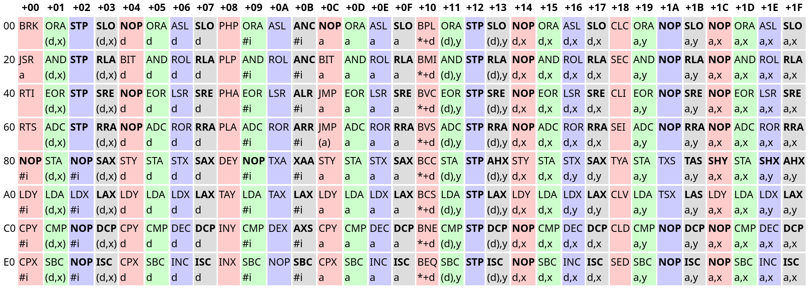
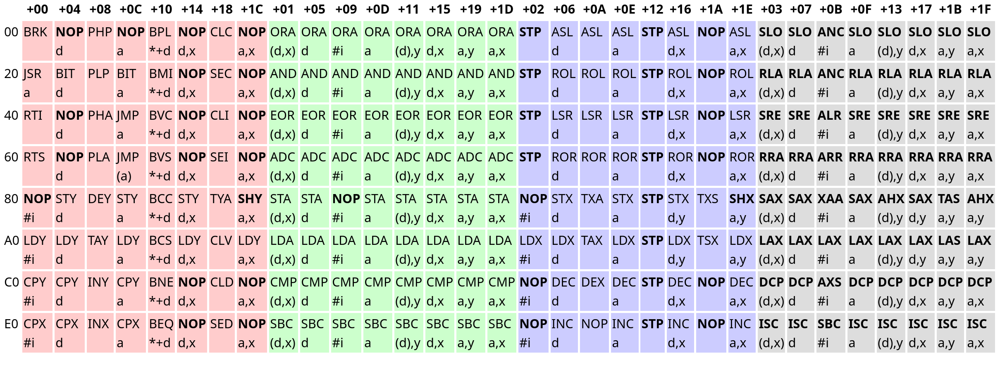

After an immense amount of time of not sticking with a project, I finally decided to pick up writing an NES emulator again, a project which I dropped years ago. You can find the codebase [here](https://github.com/analog-hors/pones). I'm not really sure I'll pull through with it this time, but I *did* get the CPU implemented: The ubiquitous [MOS Technology 6502](https://en.wikipedia.org/wiki/MOS_Technology_6502). Released in 1975, this piece of silicon found its way into some of the most influential consumer electronics of the 80s, with the Atari 2600, NES, Commodore 64, and Apple II all containing either the 6502 itself or one of its many variants. It should therefore be rather well documented, and it seems like a reasonable starting point for emulation. The NES was chosen rather arbitrarily, but it seemed like a good mix of approachable and "cool".

A robust 6502 emulation core is key to emulating many systems, so it's a natural place to start. I didn't have any idea how to begin with *that* though, so I picked the most sensible place to start: attempting to decode the instructions. Let's check [NesDev](https://www.nesdev.org/wiki/CPU_unofficial_opcodes):



Um, okay. What's... [`ADC a,x`](https://www.masswerk.at/6502/6502_instruction_set.html#ADC)?
> ```
> ADC Add Memory to Accumulator with Carry
> 
>     A + M + C -> A, C                N Z C I D V
>                                      + + + - - +
>     addressing    assembler     opc  bytes  cycles
>     immediate     ADC #oper     69   2      2  
>     zeropage      ADC oper      65   2      3  
>     zeropage,X    ADC oper,X    75   2      4  
>     absolute      ADC oper      6D   3      4  
>     absolute,X    ADC oper,X    7D   3      4* 
>     absolute,Y    ADC oper,Y    79   3      4* 
>     (indirect,X)  ADC (oper,X)  61   2      6  
>     (indirect),Y  ADC (oper),Y  71   2      5* 
> ```
Accumulator? Carry? Addressing?

Okay, never mind, that was a bad idea. Of course understanding the opcode table would require understanding the 6502's architecture in the first place; They all operate within that context. Studying that first is probably a more reasonable starting point.

## What is the 6502 architecture anyway?

[The Wikipedia page](https://en.wikipedia.org/wiki/MOS_Technology_6502):
> *Like its precursor, the 6800, the 6502 has very few registers. The 6502's registers include one 8-bit accumulator register (A), two 8-bit index registers (X and Y), 7 processor status flag bits (P; from bit 7 to bit 0 these are the negative (N), overflow (V), reserved, break (B), decimal (D), interrupt disable (I), zero (Z) and carry (C) flag), an 8-bit stack pointer (S), and a 16-bit program counter (PC).*

Sounds simple enough. Initial code:
```rust
pub trait Bus {
    fn read(&mut self, addr: u16) -> u8;
    fn write(&mut self, addr: u16, value: u8);
}

#[derive(Debug, Clone, Copy, Hash, PartialEq, Eq, PartialOrd, Ord)]
pub enum CpuFlag {
    Carry,
    Zero,
    InterruptDisable,
    Decimal,
    Break,
    Reserved,
    Overflow,
    Negative
}

pub struct Cpu6502<B> {
    pub bus: B,
    pub a: u8,
    pub x: u8,
    pub y: u8,
    pub status: u8,
    pub sp: u8,
    pub pc: u16,
}
```

`Bus` just represents the external interface from the CPU to memory or memory-mapped hardware. I haven't actually mentioned anything about the `Bus` trait so far, and that's because I just assumed it would work like that based on some vague background knowledge I had on the 6502 from years ago. [Wikipedia backs me up though](https://en.wikipedia.org/wiki/Bus_(computing)).

As for the instructions:
> *6502 instruction operation codes (opcodes) are 8 bits long and have the general form AAABBBCC, where AAA and CC define the opcode, and BBB defines the addressing mode.*

[Addressing modes?](https://en.wikipedia.org/wiki/Addressing_mode)
> *An addressing mode specifies how to calculate the effective memory address of an operand by using information held in registers and/or constants contained within a machine instruction or elsewhere.*

Makes sense. Checking the 6502's wikipedia page again:
> *Addressing modes also include implied (1-byte instructions); absolute (3 bytes); indexed absolute (3 bytes); indexed zero-page (2 bytes); relative (2 bytes); accumulator (1); indirect,x and indirect,y (2); and immediate (2).* 

So a single 6502 instruction is composed of
- A 1 byte opcode describing the operation to be performed
- The opcode's operands, which range from 0 to 2 bytes.

An *addressing mode* is simply an abstraction to describe how an opcode uses its operands.

Looking back at the table, it begins to make a bit more sense.


Here, an opcode's row describes the upper 3 bits, while its column describes the lower 5 bits. For example, `JMP a` is `$60 + $0C = $6C`. You might recall that 6502 opcodes have 3 parts arranged like `AAABBBCC`, and the table does indeed make more sense if you account for this information. Grouping opcodes with the same `CC` bits puts similar opcodes together:



The red, green, blue, and grey opcodes have the bit patterns `0b00` (0), `0b01` (1), `0b10` (2), and `0b11` (3) as their `CC` bits respectively.

The opcodes in the red group are generally control flow related. The green opcodes are ALU opcodes, and primarily relate to the `a` register. Opcodes in the blue group are read-modify-write opcodes, and the grey group is comprised entirely of "illegal" opcodes. In fact, all bolded entries are illegal - Of the 256 possible opcodes, only 151 are documented. Illegal opcodes aren't meant to be used, but they don't do nothing either, and a truly accurate emulator must implement them. I opted to avoid them for now because very few NES games used illegal opcodes.

The text following an opcode's three letter mnemonic describes that opcode's addressing mode. It took me some guesswork to figure out what they mean:
```
types:
a   - absolute address (2 bytes)
#i  - immediate value (1 byte)
d   - zero page address (1 byte)
*+d - relative address (1 byte)
y   - the y register (0 bytes, as it's implied)
x   - the x register (0 bytes, as it's implied)

syntax:
($a)  - absolute address at $a (dereference)
$l,$r - add $l and $r
```

Some notes about the types:
- Absolute addresses are normal 2-byte addresses, and there isn't anything particularly special about them.

- Immediate values pertain to immediate mode addressing, where the data is contained directly after the opcode. For example, `LDA #0` loads the value `0` into the register `a`. Immediate mode addressing can be understood as "the address of opcode's operand".

- Zero page addresses are special 1-byte addresses only capable of addressing the first 256 bytes (the zero page). The 6502 treats a zero page address as an absolute address with a high byte of `$00`. They are faster than absolute addresses because the CPU does not need to fetch the high byte, and somewhat compensate for the 6502's extremely limited register count. Note that zero page addresses are still fundamentally 8-bit, and are subject to 8-bit wraparound: `d,x` where `d = $FF` and `x = $01` wraps to `$00` and accesses `$0000`.

- Relative addresses are signed byte offsets to the program counter address, and are only used for branching operations. They are represented using two's complement.

Let's look at decoding `$31 $20`. `$31` corresponds to the opcode `AND (d),y`. Thus, this instruction reads a zero-page address (`$20`), loads the address at that location, and adds `y` to it. The accumulator (register `a`) is then bitwise ANDed with the value at the resulting memory location (and the flags set accordingly).

Now armed with the knowledge of the 6502's architecture and how its instructions were encoded, I went straight ahead to implementing the opcodes.

## The initial implementation

Given the patterns in the 6502's opcode table, my initial idea was to split up the opcodes into 3 parts according to `AAABBBCC` and `match` on a tuple of them, which looked something like
```rust
impl<B: Bus> Cpu6502<B> {

    // ...

    pub fn step(&mut self) {
        let opcode = self.take_byte_at_pc();
        let aaa = (opcode >> 5) & 0b111;
        let bbb = (opcode >> 2) & 0b111;
        let cc = opcode & 0b11;
        match (aaa, bbb, cc) {
            (8.., _, _) | (_, 8.., _) | (_, _, 4..) => unreachable!(),
            
            // match on opcode parts...
        }
    }
}
```

The main idea was that I'd be able to use different match arms to match on patterns in the opcode table to deduplicate code, while still being flexible enough to add special cases. For example, `BRK` was decoded using a simple constant pattern, while the ALU operations used more complex logic to take advantage of the opcode layout:
```rust
match (aaa, bbb, cc) {

    // ...

    (0, 0, 0) => { // BRK
        self.pc = self.pc.wrapping_add(1);
        let [pc_low, pc_high] = self.pc.to_le_bytes();
        self.stack_push(pc_high);
        self.stack_push(pc_low);
        self.stack_push(self.status | (1 << CpuFlag::Break as u8));
        self.set_flag(CpuFlag::InterruptDisable, true);
        self.pc = self.read_absolute(IRQ_BRK_VECTOR);
    }

    // ...

    // Group 1 (ALU ops)
    (op, addr_mode, 1) => {
        let addr_writable = addr_mode != 2;
        let addr = match addr_mode {
            0 => self.take_indexed_indirect(), // (d,x)
            1 => self.take_zero_page() as u16, // d
            2 => self.take_immediate(), // #i
            3 => self.take_absolute(), // a
            4 => self.take_indirect_indexed(), // (d),y
            5 => self.take_zero_page_indexed_x() as u16, // d,x
            6 => self.take_absolute_indexed_y(), // a,y
            7 => self.take_absolute_indexed_x(), // a,x,
            8.. => unreachable!()
        };

        match op {
            0 => { // ORA
                let n = self.read_byte(addr);
                self.set_a(self.a | n);
            }
            1 => { // AND
                let n = self.read_byte(addr);
                self.set_a(self.a & n);
            }
            2 => { // EOR
                let n = self.read_byte(addr);
                self.set_a(self.a ^ n);
            }
            3 => { // ADC
                // ADC impl ... (removed for brevity)
            }
            4 => { // STA
                if addr_writable {
                    self.write_byte(addr, self.a);
                }
                // !addr_writable case is NOP #i [!]
            }
            5 => { // LDA
                let n = self.read_byte(addr);
                self.set_a(n);
            }
            6 => { // CMP
                let n = self.read_byte(addr);
                self.update_nz_flags(self.a.wrapping_sub(n));
                self.set_flag(CpuFlag::Carry, self.a >= n);
            }
            7 => { // SBC
                // SBC impl ... (removed for brevity)
            }
            8.. => unreachable!()
        }
    }
    
    // ...

}
```

To help implement the logic, I copied the HTML for [the opcode table from NesDev](https://www.nesdev.org/wiki/CPU_unofficial_opcodes), parsed it, and generated match arms for decoding the opcodes, sorted by group. Very hacky, but it's a one-off job.

I also had to figure out a nice way for an opcode to read its operands, and opted to use helper functions:
```rust
fn take_byte_at_pc(&mut self) -> u8 {
    let byte = self.read_byte(self.pc);
    self.pc = self.pc.wrapping_add(1);
    byte
}

/// #i
fn take_immediate(&mut self) -> u16 {
    let addr = self.pc;
    self.take_byte_at_pc();
    addr
}

/// *+d
fn take_relative(&mut self) -> u16 {
    let offset = self.take_byte_at_pc() as i8 as u16;
    self.pc.wrapping_add(offset)
}

/// d
fn take_zero_page(&mut self) -> u8 {
    self.take_byte_at_pc()
}

/// (a)
fn take_indirect(&mut self) -> u16 {
    let addr = self.take_absolute();
    self.read_absolute(addr)
}

/// a
fn take_absolute(&mut self) -> u16 {
    u16::from_le_bytes([self.take_byte_at_pc(), self.take_byte_at_pc()])
}

/// a,x
fn take_absolute_indexed_x(&mut self) -> u16 {
    self.take_absolute().wrapping_add(self.x as u16)
}

/// a,y
fn take_absolute_indexed_y(&mut self) -> u16 {
    self.take_absolute().wrapping_add(self.y as u16)
}

/// d,x
fn take_zero_page_indexed_x(&mut self) -> u8 {
    self.take_zero_page().wrapping_add(self.x)
}

/// d,y
fn take_zero_page_indexed_y(&mut self) -> u8 {
    self.take_zero_page().wrapping_add(self.y)
}

/// (d,x)
fn take_indexed_indirect(&mut self) -> u16 {
    let addr = self.take_zero_page_indexed_x() as u16;
    self.read_absolute(addr)
}

/// (d),y
fn take_indirect_indexed(&mut self) -> u16 {
    let addr = self.take_zero_page() as u16;
    self.read_absolute(addr).wrapping_add(self.y as u16)
}
```

After that, it was fairly straightforward to implement the instructionss with the help of [6502.org](http://6502.org/tutorials/6502opcodes.html) and [Masswerk](https://www.masswerk.at/6502/6502_instruction_set.html).

Some things I encountered while implementing the emulator:
- Both of the linked pages just lie about `BRK` not setting the interrupt disable flag. 6502.org tells you that `BRK` only affects the `B` flag, while Masswerk claims that `BRK` doesn't set the interrupt disable flag automatically. However, it *does*, and the diagram on the Masswerk page even says that it enables the flag, contradicting the earlier statement.

- The negative and zero flags are handled pretty much the same way for the vast majority of instructions: They are set when the `a`, `x`, or `y` registers are modified. However, they are also affected by the read-modify-write instructions, even if they never interact with any of those registers. I ended up wrapping assignment to `a`, `x`, and `y` behind helper functions.

- The break and reserved flags aren't real! The reserved flag is simply always on, while the break flag is only enabled in the status byte pushed to the stack by `BRK` to indicate a software interrupt. Neither flag can actually be set, because they do not exist in hardware. Note that this is in contrast to the decimal mode flag in the NES's 6502 variant, because even though the NES didn't support decimal mode, the flag still exists, and can be set and cleared.

- `ADC` (add with carry) and `SBC` (subtract with carry) are an absolute pain to implement, and are by far the most complex instructions. Implementing how they interact with the overflow flag was especially difficult, and I referred to [this blog post by Ken Shirriff](http://www.righto.com/2012/12/the-6502-overflow-flag-explained.html). They also have a [BCD](https://en.wikipedia.org/wiki/Binary-coded_decimal) mode, which is even more painful to implement. The NES used a variant with this feature disabled, but I wanted to implement it just for completeness. I ended up referring to [this forum post](https://forums.nesdev.org/viewtopic.php?t=3070) and [Symon](https://github.com/sethm/symon). My implementation still doesn't handle setting the negative, zero, and overflow flags correctly, but it should be fine, because those flags were never meant to be used in BCD mode. I do plan on getting back to it eventually though.

## Testing the emulator

After I finished writing the initial code, I started looking for some test binaries. I ended up implementing `6502_functional_test.a65`, `6502_interrupt_test.a65`, and `6502_decimal_test.a65` from [Klaus Dormann's test suite](https://github.com/Klaus2m5/6502_65C02_functional_tests/). Annoyingly, the binaries in the `bin_files` directory were outdated and only contained two test suites anyway. For some reason the provided assembler's Linux binary didn't run either so I ended up running it through Wine. The test code itself is pretty simple:
```rust
fn load_mem(name: &str, start_addr: u16) -> Memory {
    let path = format!("tests/{}", name);
    let bin = std::fs::read(path).expect("failed to read test binary");
    let mut mem = [0; 65536];
    mem[start_addr as usize..start_addr as usize + bin.len()].copy_from_slice(&bin);
    Memory(mem)
}

#[test]
fn functional_test() {
    const BIN_START_ADDR: u16 = 0x000A;
    const PROGRAM_START: u16 = 0x0400;
    const SUCCESS_TRAP: u16 = 0x3469;

    let mem = load_mem("klaus/bin/6502_functional_test.bin", BIN_START_ADDR);
    let mut cpu = Cpu6502::new(mem);
    cpu.pc = PROGRAM_START;
    loop {
        let prev_pc = cpu.pc;
        cpu.step();
        if cpu.pc == prev_pc {
            break;
        }
    }
    assert!(cpu.pc == SUCCESS_TRAP, "trapped at {:#06X}", cpu.pc);
}

#[test]
fn interrupt_test() {
    const BIN_START_ADDR: u16 = 0x000A;
    const PROGRAM_START: u16 = 0x0400;
    const SUCCESS_TRAP: u16 = 0x06F5;
    const FEEDBACK_ADDR: u16 = 0xBFFC;
    const IRQ_BIT: u8 = 1 << 0;
    const NMI_BIT: u8 = 1 << 1;

    let mem = load_mem("klaus/bin/6502_interrupt_test.bin", BIN_START_ADDR);
    let mut cpu = Cpu6502::new(mem);
    cpu.pc = PROGRAM_START;
    cpu.bus.write(FEEDBACK_ADDR, 0);
    loop {
        let prev_feedback = cpu.bus.read(FEEDBACK_ADDR);
        let prev_pc = cpu.pc;
        cpu.step();
        let feedback = cpu.bus.read(FEEDBACK_ADDR);
        if (feedback & !prev_feedback) & NMI_BIT != 0 {
            cpu.nmi();
        } else if feedback & IRQ_BIT != 0 {
            cpu.irq();
        }
        if cpu.pc == prev_pc {
            break;
        }
    }
    assert!(cpu.pc == SUCCESS_TRAP, "trapped at {:#06X}", cpu.pc);
}

#[test]
fn decimal_test() {
    const BIN_START_ADDR: u16 = 0x0200;
    const PROGRAM_START: u16 = 0x0200;
    const ERROR_ADDR: u16 = 0x000B;
    const DONE_ADDR: u16 = 0x024B;

    let mem = load_mem("decimal/bin/6502_decimal_test.bin", BIN_START_ADDR);
    let mut cpu = Cpu6502::new(mem);
    cpu.pc = PROGRAM_START;
    while cpu.pc != DONE_ADDR {
        cpu.step();
    }
    if cpu.bus.read(ERROR_ADDR) != 0 {
        panic!("decimal mode test failed");
    }
}
```

The functional and interrupt tests rely on "traps" to report their output, which is just an instruction that jumps to itself, halting execution. The decimal test just has a fixed address for the program end and an address containing the result. The actual mechanisms for running the functional and decimal tests are dead simple, but the interrupt test was extremely difficult to get working, because it relies on a feedback register at a certain memory address to allow the code to interrupt itself. No emulator I found online that implemented this test could actually agree on how you were supposed to interpret the feedback register, and I ended up trying out different combinations on an existing known-good 6502 emulator to get it to pass the test.

It also turns out that you can still pass tests if your read-modify-write instructions read from the accumulator instead of their target address. This is probably because the test binaries first store the value in the accumulator before writing it to the target address, and I only managed to catch this because I implemented an [EhBasic](http://retro.hansotten.nl/6502-sbc/lee-davison-web-site/enhanced-6502-basic/) port for fun and noticed that it bugged out. I debugged this by producing traces of the CPU's registers and comparing them against existing emulators, which worked incredibly well and was probably something I should have started doing earlier into the development process.

## Refining the code

I managed to get all the tests to pass, but I still wasn't really happy with a few aspects of the emulator.

### Moving out the register handling code
The `Cpu6502` `impl` block was pretty cluttered, and a large part of it was due to a lot of helpers that operated only on the registers. Like I mentioned earlier, the `a`, `x`, and `y` registers are fairly intertwined with the flags, so I figured it would be worthwhile to move them out:
```rust
#[derive(Debug, Default, Clone, Copy, PartialEq, Eq, Hash)]
pub struct RegisterState {
    pub a: u8,
    pub x: u8,
    pub y: u8,
    pub status: u8
}
```

### Replacing the status register with bools
Despite the code implementing the status register as an 8-bit bitfield, the 6502 only has 6 true flags. Having 2 extra bits made the implementation kind of awkward, and it didn't really sit right with me that it could be an invalid state, so I just switched to 6 bools:
```rust
#[derive(Debug, Default, Clone, Copy, PartialEq, Eq, Hash)]
pub struct RegisterState {
    pub a: u8,
    pub x: u8,
    pub y: u8,
    pub carry: bool,
    pub zero: bool,
    pub interrupt_disable: bool,
    pub decimal: bool,
    pub overflow: bool,
    pub negative: bool
}

impl RegisterState {
    pub fn update_a(&mut self, value: u8) {
        self.a = value;
        self.update_nz_flags(self.a);
    }

    pub fn update_x(&mut self, value: u8) {
        self.x = value;
        self.update_nz_flags(self.x);
    }

    pub fn update_y(&mut self, value: u8) {
        self.y = value;
        self.update_nz_flags(self.y);
    }

    pub fn update_nz_flags(&mut self, value: u8) {
        self.negative = (value as i8).is_negative();
        self.zero = value == 0;
    }

    pub fn get_status(&self, brk: bool) -> u8 {
        let b = |flag, shift| (flag as u8) << shift;
        b(self.carry, 0)
            | b(self.zero, 1)
            | b(self.interrupt_disable, 2)
            | b(self.decimal, 3)
            | b(brk, 4)
            | b(true, 5)
            | b(self.overflow, 6)
            | b(self.negative, 7)
    }

    pub fn set_status(&mut self, value: u8) {
        let b = |shift: u8| value & (1 << shift) != 0;
        self.carry = b(0);
        self.zero = b(1);
        self.interrupt_disable = b(2);
        self.decimal = b(3);
        self.overflow = b(6);
        self.negative = b(7);
    }
}
```

This also made working with each flag simpler, which is a nice bonus.

### Completely redoing instruction decoding

These were relatively small changes though, and my biggest problem was how cluttered the `step` function was. Fundamentally, the biggest issue was that it was too clever; It tried to deduplicate code by taking advantage of the opcode layout, but too many special cases meant that it was incredibly hard to parse. After some thinking, I figured that a simple 256 entry `match` wouldn't be too bad if each match arm was kept to one line. I also realized each opcode could be implemented as a function that took an address as an operand, and that that address could be calculated from the addressing mode information alone. I wrote some macro magic to implement this:
```rust
dispatch! {
    0x00 brk_implied()
    0x01 ora("(d,x)")
    // 0x02 stp_implied() // illegal
    // 0x03 slo("(d,x)") // illegal
    // 0x04 nop("d") // illegal
    0x05 ora("d")
    0x06 asl("d")
    // 0x07 slo("d") // illegal
    0x08 php_implied()
    0x09 ora("#i")
    0x0A asl_implied()
    // 0x0B anc("#i") // illegal
    // 0x0C nop("a") // illegal
    0x0D ora("a")
    0x0E asl("a")

    // ...
}
```

which calls into functions like
```rust
fn inx_implied(&mut self) {
    self.reg.update_x(self.reg.x.wrapping_add(1));
}

fn dex_implied(&mut self) {
    self.reg.update_x(self.reg.x.wrapping_sub(1));
}

fn inc(&mut self, addr: u16) {
    let n = self.bus.read(addr);
    let result = n.wrapping_add(1);
    self.bus.write(addr, result);
    self.reg.update_nz_flags(result);
}

fn dec(&mut self, addr: u16) {
    let n = self.bus.read(addr);
    let result = n.wrapping_sub(1);
    self.bus.write(addr, result);
    self.reg.update_nz_flags(result);
}
```

The macro expands to a large `match` that then calls the handler function, optionally calculating an address based on a provided addressing mode. Converting the string to addressing mode code is just implemented with pattern matching in the macro. The macro arguably isn't necessary, but I felt that it matched the syntax of the assembler mnemonics closer, and it's also a bit hard to be compact otherwise, especially since Rust won't let you do something like `self.and(self.take_immediate())` if both functions are `&mut self`. Overall, the macro is a little weird, but making the decoding significantly more straightforward massively helped with readability.

## What next?
That's as far as I got this time. There are still some features my 6502 emulator is missing:
- Cycle counting (most important)
- Accurate decimal mode flags
- Illegal opcodes

For now though, I'm mostly happy with the 6502 implementation that I reached; I don't know quite yet what to approach next. The next primary goal is probably implementing actual NES things. I might get to it eventually or I might not, we'll see.
