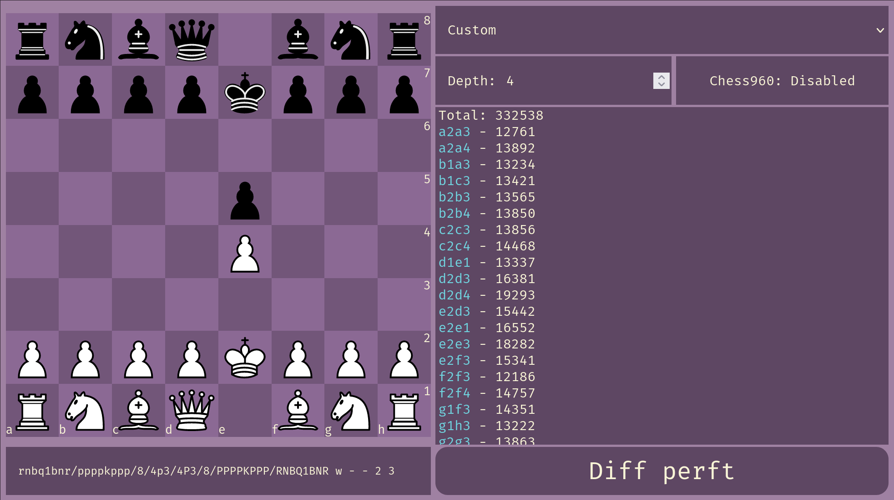

## [`cozy-chess`](https://github.com/analog-hors/cozy-chess)
```
$ cargo run --release --example perft -- 7
   Compiling cozy-chess v0.3.0
    Finished release [optimized] target(s) in 6.37s
     Running `target\release\examples\perft.exe 7`
3195901860 nodes in 10.05s (318045465 nps)
```
A fast Chess and Chess960 move generation library in Rust suitable for Chess engines.

## [`webperft`](https://analog-hors.github.io/webperft/)


A Chess and Chess960 move generation testing utility that helps you easily check [`perft`](https://www.chessprogramming.org/Perft) results in the browser.

## [`tantabus`](https://github.com/analog-hors/tantabus)
A superhuman Chess and Chess960 engine written in Rust. Built on top of `cozy-chess`.

## [`lunatic-web`](https://analog-hors.github.io/lunatic-web/)


A web client for a WebAssembly port of Lunatic, the much weaker predecessor to Tantabus.

## [`cold-clear-web`](https://analog-hors.github.io/cold-clear-web/)


A web client for a WebAssembly port of MinusKelvin's [`cold-clear`](https://github.com/MinusKelvin/cold-clear) Tetris AI.

## [`pones`](https://github.com/analog-hors/pones)
A work in progress NES emulator written in Rust.

## [`ColdTaco`](https://github.com/analog-hors/pones)


A C# program that leverages the [Nintaco API](https://nintaco.com/) to get [`cold-clear`](https://github.com/MinusKelvin/cold-clear) to play NES Tetris.

## [`glowfish`](https://wasm4.org/play/glowfish-chess)


A simple [WASM-4](https://wasm4.org/) chess game with an optional "Vs CPU" mode.

## [`nnue-rs`](https://github.com/analog-hors/nnue-rs)
A Rust library for the inference of [Stockfish NNUE](https://stockfishchess.org/blog/2020/introducing-nnue-evaluation) neural networks. 

## [`mnist-digit-nn`](https://github.com/analog-hors/mnist-digit-nn)
A simple neural network-based digit classifier based on the [MNIST database](https://en.wikipedia.org/wiki/MNIST_database). Written as an excerise to better understand backpropagation and neural networks.
